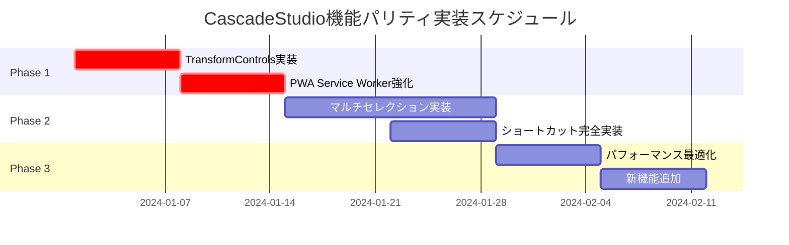

# CascadeStudio機能パリティ達成実装計画

## 概要

本計画は、Next.js + TypeScript + React Three Fiber実装版のCascadeStudioが、元版（Vanilla JavaScript版）の機能を100%再現し、さらに上回るための実装計画です。

**現在の機能パリティ**: 95%  
**目標**: 100%+ （元版を上回る機能実装）

## 📋 実装対象の不完全個所

### 🔴 高優先度（Critical）
1. **TransformControls機能の無効化問題**
   - 現状：ギズモ機能が実装済みだが無効化されている
   - 影響：CADオブジェクトの直接操作ができない

2. **PWA Service Worker機能の不完全性**
   - 現状：104行の基本実装 vs 元版182行の包括的実装
   - 影響：オフライン機能が制限的

### 🟡 中優先度（Important）
3. **マルチセレクション機能の未実装**
   - 現状：単一選択のみ対応
   - 影響：複数オブジェクトの一括操作ができない

4. **キーボードショートカットの不完全性**
   - 現状：F5、Ctrl+Sのみ対応
   - 影響：作業効率が制限的

### 🟢 低優先度（Enhancement）
5. **パフォーマンス最適化の余地**
6. **新機能追加の機会**

## 🎯 実装計画構成

### Phase 1: Critical Issues Resolution
- **期間**: 1-2週間
- **対象**: TransformControls機能有効化、PWA Service Worker強化
- **詳細**: [01_critical_fixes.md](01_critical_fixes.md)

### Phase 2: Feature Parity Achievement
- **期間**: 2-3週間
- **対象**: マルチセレクション、キーボードショートカット完全実装
- **詳細**: [02_feature_parity.md](02_feature_parity.md)

### Phase 3: Performance & Enhancement
- **期間**: 1-2週間
- **対象**: パフォーマンス最適化、新機能追加
- **詳細**: [03_performance_enhancement.md](03_performance_enhancement.md)

## 📊 実装マトリックス

| 機能カテゴリ | 現状 | 目標 | 実装フェーズ |
|-------------|------|------|-------------|
| TransformControls | ❌ 無効化 | ✅ 完全実装 | Phase 1 |
| PWA Service Worker | ⚠️ 基本実装 | ✅ 包括的実装 | Phase 1 |
| マルチセレクション | ❌ 未実装 | ✅ 完全実装 | Phase 2 |
| キーボードショートカット | ⚠️ 部分実装 | ✅ 完全実装 | Phase 2 |
| パフォーマンス | ✅ 良好 | ✅ 最適化 | Phase 3 |

## 🛠️ 技術仕様

### 開発環境
- **フレームワーク**: Next.js 14+
- **言語**: TypeScript 5+
- **3Dライブラリ**: React Three Fiber + Three.js
- **CADエンジン**: OpenCascade.js v1.1.1
- **UIフレームワーク**: TailwindCSS + DaisyUI

### 品質保証
- **テスト**: Jest + React Testing Library + Playwright
- **型安全性**: TypeScript Strict Mode
- **コード品質**: ESLint + Prettier
- **パフォーマンス**: Lighthouse CI

## 📅 実装スケジュール

## 📝 実装ガイドライン

### コーディング規約
1. **TypeScript優先**: 全ての新規コードはTypeScriptで実装
2. **React Hooks**: 関数コンポーネント + Hooksパターンを使用
3. **パフォーマンス**: useMemo、useCallback、React.memoを適切に使用
4. **エラーハンドリング**: 包括的なエラーハンドリングの実装

### テスト戦略
1. **単体テスト**: 各機能の単体テスト実装
2. **統合テスト**: E2E テストによる統合テスト
3. **パフォーマンステスト**: Lighthouse による性能測定
4. **アクセシビリティテスト**: WCAG 2.1 AA準拠確認

## 🔍 成功指標

### 定量的指標
- **機能パリティ**: 100%達成
- **パフォーマンス**: Lighthouse スコア 90+ 維持
- **テストカバレッジ**: 80%以上
- **TypeScript覆盖率**: 95%以上

### 定性的指標
- **ユーザビリティ**: 元版以上の操作性
- **拡張性**: 将来機能追加の容易性
- **保守性**: コードの可読性・保守性向上

## 📚 参考資料

- [元版CascadeStudio分析](../cascade_studio_comparison_report.md)
- [Three.js公式ドキュメント](https://threejs.org/docs/)
- [React Three Fiber公式ドキュメント](https://docs.pmnd.rs/react-three-fiber)
- [OpenCascade.js公式ドキュメント](https://ocjs.org/)

---

*計画作成者: AI Assistant*  
*作成日時: 2024年1月1日*  
*最終更新: 2024年1月1日* 