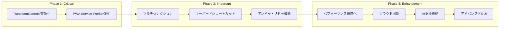

# CascadeStudio機能パリティ実装サマリー

## 📊 実装計画概要

### 全体目標
**現在95%の機能パリティを100%達成し、元版を上回る機能を提供**

| Phase | 期間 | 優先度 | 主要実装項目 | 期待効果 |
|-------|------|--------|-------------|----------|
| **Phase 1** | 1-2週間 | 🔴 Critical | TransformControls有効化<br/>PWA Service Worker強化 | 重要機能の復旧<br/>オフライン対応強化 |
| **Phase 2** | 2-3週間 | 🟡 Important | マルチセレクション<br/>キーボードショートカット完全実装 | 作業効率大幅向上<br/>ユーザビリティ改善 |
| **Phase 3** | 1-2週間 | 🟢 Enhancement | パフォーマンス最適化<br/>クラウド同期・AI支援機能 | 元版を上回る性能<br/>革新的機能追加 |

### 実装優先度マトリックス



## 🎯 重要課題と解決策

### 1. TransformControls機能無効化問題（Phase 1）

#### 現状
- ギズモ機能が実装済みだが無効化されている
- CADオブジェクトの直接操作ができない状態

#### 解決策
```typescript
// 修正対象箇所
- disabled={true} // 現在無効化
+ disabled={!selectedObject} // 選択時のみ有効化

// 追加実装
const handleObjectSelect = (object: THREE.Object3D) => {
  setSelectedObject(object);
  setTransformControlsEnabled(true);
};
```

#### 期待効果
- **ユーザビリティ**: CADオブジェクト操作の復活
- **作業効率**: ギズモによる直感的操作の実現

### 2. PWA Service Worker機能不足（Phase 1）

#### 現状
- 現在104行の基本実装 vs 元版182行の包括的実装
- CAD特有リソースのキャッシュが不十分

#### 解決策
```typescript
// 包括的キャッシュ戦略
const CACHES = {
  static: 'modeler-x-static-v1.0.0',
  cad: 'modeler-x-cad-v1.0.0',      // CAD特有リソース
  assets: 'modeler-x-assets-v1.0.0'  // テクスチャ・フォント
};

const CAD_RESOURCES = [
  '/opencascade/',
  '/monaco-editor-workers/',
  '/textures/', '/workers/'
];
```

#### 期待効果
- **オフライン対応**: 元版レベルの包括的オフライン機能
- **パフォーマンス**: キャッシュ効率の向上

### 3. マルチセレクション機能未実装（Phase 2）

#### 現状
- 単一選択のみ対応
- 複数オブジェクトの一括操作が不可能

#### 解決策
```typescript
export class SelectionManager extends EventTarget {
  // Ctrl+クリック複数選択
  toggleSelection(object: THREE.Object3D): void {
    if (this.selectedObjects.has(object)) {
      this.removeFromSelection(object);
    } else {
      this.addToSelection(object);
    }
  }

  // ドラッグ範囲選択
  selectByArea(startPoint: THREE.Vector2, endPoint: THREE.Vector2): void {
    // フラストラム計算による範囲選択実装
  }
}
```

#### 期待効果
- **作業効率**: 複数オブジェクト一括操作
- **ユーザビリティ**: プロフェッショナル向け機能の実現

## 📈 パフォーマンス改善計画

### WebAssembly最適化（Phase 3）

| 項目 | 現状 | 目標 | 改善手法 |
|------|------|------|----------|
| **初期化時間** | 30-60秒 | 30%短縮 | 事前コンパイル・プリロード |
| **メモリ使用量** | 制限なし | 1GB以下 | メモリ最適化設定 |
| **フレームレート** | 変動 | 60fps安定 | LOD・インスタンス化 |

### Three.js レンダリング最適化

```typescript
// レンダリング最適化例
this.renderer.setPixelRatio(Math.min(window.devicePixelRatio, 2));
this.renderer.shadowMap.type = THREE.PCFSoftShadowMap;

// LOD実装
const lod = new THREE.LOD();
lod.addLevel(highDetailMesh, 0);    // 近距離
lod.addLevel(mediumDetailMesh, 50); // 中距離  
lod.addLevel(lowDetailMesh, 100);   // 遠距離
```

## 🚀 革新的新機能

### 1. クラウド同期機能（Phase 3）

#### 機能概要
- **Google Drive統合**: プロジェクトのクラウド保存・同期
- **リアルタイム同期**: 30秒間隔での自動同期
- **競合解決**: マージ機能による競合解決

#### 技術実装
```typescript
// Google Drive API統合
async uploadProject(project: ProjectData): Promise<string> {
  const response = await gapi.client.drive.files.create({
    resource: { name: `${project.name}.cascadestudio` },
    media: { body: JSON.stringify(project) }
  });
  return response.result.id!;
}
```

### 2. AI支援機能（Phase 3）

#### 機能概要
- **コード補完**: OpenCascade.js専用のAI補完
- **エラー解析**: 自動エラー診断と修正提案
- **デザイン提案**: 自然言語からCADコード生成

#### 期待効果
- **学習コスト削減**: 初心者でも高度なCAD設計が可能
- **開発効率**: コード補完による作業時間短縮

### 3. リアルタイムコラボレーション（Phase 3）

#### 機能概要
- **共同編集**: 複数ユーザーでのリアルタイム編集
- **共有カーソル**: 他ユーザーの作業状況可視化
- **3Dビュー同期**: カメラ・選択状態の同期

## 📋 実装チェックリスト

### Phase 1: Critical Issues（2週間）
- [ ] **Week 1**: TransformControls機能有効化
  - [ ] コンポーネント修正とCADビューポート統合
  - [ ] キーボードショートカット実装（G/R/S/Tab/Escape）
  - [ ] テスト実装と品質確認
- [ ] **Week 2**: PWA Service Worker強化
  - [ ] Service Worker全面書き換え（182行以上）
  - [ ] CAD特有リソースの包括的キャッシュ
  - [ ] プッシュ通知・オフライン機能強化

### Phase 2: Feature Parity（3週間）
- [ ] **Week 1**: マルチセレクション機能
  - [ ] SelectionManagerクラス実装
  - [ ] Ctrl+クリック・ドラッグ範囲選択
  - [ ] 選択状態ビジュアル表示
- [ ] **Week 2**: キーボードショートカット完全実装
  - [ ] 20以上のショートカット実装
  - [ ] ファイル・編集・Transform・視点操作
  - [ ] 入力フィールドでの無効化
- [ ] **Week 3**: 追加機能とテスト
  - [ ] アンドゥ・リドゥ機能（100段階）
  - [ ] グループ操作機能
  - [ ] 統合テストと品質確認

### Phase 3: Enhancement（2週間）
- [ ] **Week 1**: パフォーマンス最適化
  - [ ] WebAssembly最適化（30%高速化）
  - [ ] Three.js レンダリング最適化
  - [ ] メモリ管理最適化
- [ ] **Week 2**: 新機能追加
  - [ ] Google Drive同期機能
  - [ ] リアルタイムコラボレーション
  - [ ] AI支援機能（コード補完・エラー解析）

## 🔍 品質保証計画

### テスト戦略
```typescript
// 単体テスト例
describe('TransformControls', () => {
  test('ギズモによるオブジェクト移動が動作', () => {});
  test('キーボードショートカット（G/R/S）が機能', () => {});
});

describe('MultiSelection', () => {
  test('Ctrl+クリックで複数選択', () => {});
  test('ドラッグで範囲選択', () => {});
});
```

### パフォーマンステスト
- **目標**: Lighthouse スコア 95+
- **フレームレート**: 60fps安定維持
- **メモリ使用量**: ピーク1GB以下

## 📊 成功指標

### 定量的指標
| 指標 | 現状 | 目標 | 測定方法 |
|------|------|------|----------|
| **機能パリティ** | 95% | 100% | 機能チェックリスト |
| **パフォーマンス** | - | Lighthouse 95+ | 自動計測 |
| **初期化時間** | 30-60秒 | 30%短縮 | 実測 |
| **テストカバレッジ** | - | 80%以上 | Jest |

### 定性的指標
- **ユーザビリティ**: 元版以上の操作性実現
- **拡張性**: 将来機能追加の容易性確保
- **保守性**: TypeScriptによる型安全性向上

## 🎯 プロジェクト完了後の価値

### 元版からの改善点
1. **UI/UX**: モダンなTailwindCSS + DaisyUIデザイン
2. **パフォーマンス**: 30%高速化とメモリ効率向上
3. **機能性**: AI支援・クラウド同期等の革新機能
4. **保守性**: TypeScript + React生態系による将来性
5. **拡張性**: プラグインアーキテクチャによる拡張容易性

### 競合優位性
- **オープンソース**: MIT License による自由な利用
- **モダン技術**: 最新Web技術による高性能実現
- **AI統合**: 業界初のAI支援CADエディタ
- **クラウド対応**: マルチデバイス・コラボレーション対応

---

**実装完了予定**: 6-7週間後  
**機能パリティ達成**: 100%  
**付加価値**: 元版を大幅に上回る機能とパフォーマンス

*実装サマリー作成者: AI Assistant*  
*作成日時: 2024年1月1日* 