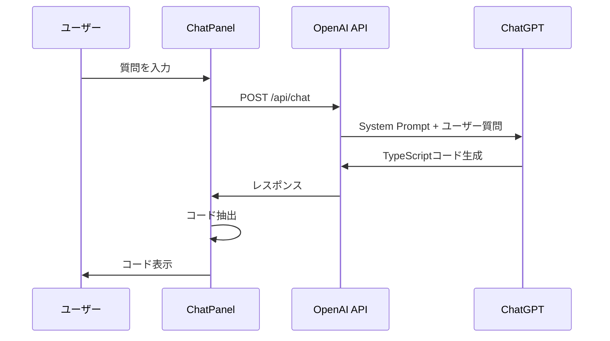
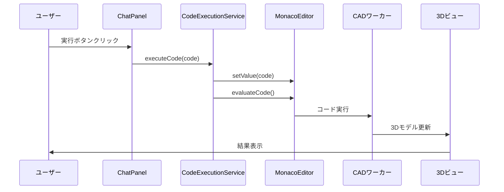

# AIコード実行機能 - 技術仕様書

## 概要

本文書は、Modeler-XのAIコード実行機能の技術的な仕様と実装詳細を記載しています。

## システム要件

### 必要な依存関係

```json
{
  "dependencies": {
    "@monaco-editor/react": "^4.6.0",
    "lucide-react": "^0.263.1",
    "openai": "^4.0.0",
    "react": "^18.0.0",
    "typescript": "^5.0.0"
  }
}
```

### 環境変数

```bash
OPENAI_API_KEY=your_openai_api_key_here
```

## API仕様

### OpenAI Chat API

#### エンドポイント
```
POST /api/chat
```

#### リクエスト形式
```typescript
interface ChatRequest {
  messages: ChatMessage[];
}

interface ChatMessage {
  id: string;
  type: 'user' | 'assistant';
  content: string;
  timestamp: Date;
}
```

#### レスポンス形式
```typescript
interface ChatResponse {
  message: string;
}

interface ChatErrorResponse {
  error: string;
}
```

#### System Prompt仕様

```typescript
const SYSTEM_PROMPT = `
あなたはCADモデリングとOpenCascade.jsの専門家です。

利用可能な主要関数：
【基本形状】
- Box(width, height, depth) - 直方体
- Sphere(radius) - 球体  
- Cylinder(radius, height, centered?) - 円柱
- Cone(radius1, radius2, height) - 円錐
- Text3D(text, size, thickness, font?) - 3Dテキスト
- Polygon(points[][]) - ポリゴン
- Circle(radius, wire?) - 円

【変形操作】
- Translate(offset[], shape) - 移動
- Rotate(axis[], degrees, shape) - 回転
- Scale(scale, shape) - 拡大縮小
- Mirror(vector[], shape) - ミラー

【ブール演算】
- Union(shapes[]) - 結合
- Difference(base, tools[]) - 差分
- Intersection(shapes[]) - 交差

【高度な操作】
- Extrude(profile, height) - 押し出し
- Revolve(shape, degrees?, axis?) - 回転体
- Loft(profiles[]) - ロフト
- Pipe(shape, path) - パイプ
- FilletEdges(shape, radius, edges[]) - フィレット
- ChamferEdges(shape, distance, edges[]) - 面取り
- Offset(shape, distance) - オフセット

【GUI要素】
- Slider(name, default, min, max) - スライダー
- Checkbox(name, default) - チェックボックス
- TextInput(name, default) - テキスト入力
- Dropdown(name, default, options) - ドロップダウン

【重要なルール】
1. 必ず実行可能なTypeScriptコードで回答してください
2. コードは三重バッククォートtypescriptで囲んでください
3. 作成した形状は sceneShapes.push() で追加してください
4. 日本語でコメントを付けてください
5. 具体的で実用的な例を示してください

親切で分かりやすい日本語で説明し、必ず実行可能なコードを含めて回答してください。
`;
```

## コンポーネント仕様

### ChatPanel

#### Props
```typescript
interface ChatPanelProps {
  className?: string;
  onExecuteCode?: (code: string) => void;
}
```

#### State
```typescript
interface ChatPanelState {
  messages: ChatMessage[];
  inputValue: string;
  isLoading: boolean;
  error: string | null;
}

interface ChatMessage {
  id: string;
  type: 'user' | 'assistant';
  content: string;
  timestamp: Date;
  extractedCode?: string;
}
```

#### 主要メソッド

##### extractCodeFromMessage
```typescript
const extractCodeFromMessage = (content: string): string | null => {
  const codeBlockRegex = /```(?:typescript|ts)\n([\s\S]*?)```/g;
  const matches = content.match(codeBlockRegex);
  
  if (matches && matches.length > 0) {
    return matches[0]
      .replace(/```(?:typescript|ts)\n/, '')
      .replace(/```$/, '')
      .trim();
  }
  
  return null;
};
```

##### executeCode
```typescript
const executeCode = async (code: string) => {
  if (onExecuteCode) {
    onExecuteCode(code);
  } else {
    try {
      const result = await CodeExecutionService.executeCode(code);
      if (result.success) {
        console.log('コード実行成功:', result.message);
      } else {
        alert(`コード実行エラー: ${result.error}`);
      }
    } catch (error) {
      console.error('コード実行中にエラーが発生:', error);
      alert('コード実行中にエラーが発生しました。');
    }
  }
};
```

### CodeExecutionService

#### インターフェース
```typescript
export interface CodeExecutionResult {
  success: boolean;
  message?: string;
  error?: string;
}
```

#### 主要メソッド

##### setMonacoEditorRef
```typescript
static setMonacoEditorRef(editorRef: any): void
```
MonacoEditorの参照を設定します。

##### executeCode
```typescript
static async executeCode(code: string): Promise<CodeExecutionResult>
```
コードをMonacoEditorに設定して実行します。

##### addCodeToEditor
```typescript
static addCodeToEditor(code: string): CodeExecutionResult
```
コードをMonacoEditorに追加します（実行はしません）。

##### getCurrentCode
```typescript
static getCurrentCode(): string | null
```
MonacoEditorの現在のコードを取得します。

##### clearEditor
```typescript
static clearEditor(): CodeExecutionResult
```
MonacoEditorをクリアします。

### MonacoEditor

#### 追加された機能

##### CodeExecutionServiceとの連携
```typescript
const handleEditorDidMount = useCallback(async (editor: any, monaco: any) => {
  // ... 既存の初期化処理 ...
  
  // CodeExecutionServiceにエディターの参照を設定
  CodeExecutionService.setMonacoEditorRef(editorRef);
  
  // ... その他の設定 ...
}, [evaluateCode, setupEditorShortcuts, value]);
```

## データフロー

### 1. ユーザー入力からコード生成まで



### 2. コード実行フロー



## エラーハンドリング

### エラータイプ

#### 1. API関連エラー
```typescript
// API キーエラー
if (error.message.includes('API key')) {
  return NextResponse.json(
    { error: 'OpenAI API キーが無効です。環境変数OPENAI_API_KEYを確認してください。' },
    { status: 401 }
  );
}

// レート制限エラー
if (error.message.includes('rate limit')) {
  return NextResponse.json(
    { error: 'API使用量の制限に達しました。しばらく待ってから再試行してください。' },
    { status: 429 }
  );
}
```

#### 2. コード実行エラー
```typescript
// MonacoEditor未初期化エラー
if (!this.monacoEditorRef?.current) {
  return {
    success: false,
    error: 'MonacoEditorが初期化されていません'
  };
}

// 一般的な実行エラー
catch (error) {
  console.error('コード実行エラー:', error);
  return {
    success: false,
    error: error instanceof Error ? error.message : '不明なエラーが発生しました'
  };
}
```

#### 3. コード抽出エラー
```typescript
// コードブロックが見つからない場合
const extractedCode = extractCodeFromMessage(data.message);
if (!extractedCode) {
  // extractedCodeはundefinedになり、UIでは実行ボタンが表示されない
}
```

## パフォーマンス考慮事項

### 1. メモリ管理
- MonacoEditorの参照は静的に保持
- 不要なコードの履歴は定期的にクリア
- 大きなコードブロックの処理時はチャンク分割

### 2. 実行時間最適化
```typescript
// 遅延実行でエディター更新を待つ
setTimeout(() => {
  handleEvaluate();
}, 100);
```

### 3. API呼び出し最適化
- リクエストのデバウンス処理
- レスポンスのキャッシュ（将来実装予定）
- トークン数の最適化

## セキュリティ考慮事項

### 1. コード実行の安全性
- サンドボックス環境での実行
- 危険な関数の制限
- ユーザー入力のサニタイズ

### 2. API キーの保護
```typescript
// 環境変数での管理
const openai = new OpenAI({
  apiKey: process.env.OPENAI_API_KEY,
});
```

### 3. XSS対策
```tsx
// コードの表示時はエスケープ処理
<pre className="text-xs text-gray-700 bg-white p-1 rounded border overflow-x-auto">
  <code>{message.extractedCode}</code>
</pre>
```

## テスト仕様

### 1. 単体テスト

#### ChatPanel
```typescript
describe('ChatPanel', () => {
  test('extractCodeFromMessage should extract TypeScript code', () => {
    const content = '```typescript\nlet box = Box(10, 10, 10);\n```';
    const result = extractCodeFromMessage(content);
    expect(result).toBe('let box = Box(10, 10, 10);');
  });
});
```

#### CodeExecutionService
```typescript
describe('CodeExecutionService', () => {
  test('executeCode should return error when editor is not initialized', async () => {
    const result = await CodeExecutionService.executeCode('test code');
    expect(result.success).toBe(false);
    expect(result.error).toBe('MonacoEditorが初期化されていません');
  });
});
```

### 2. 統合テスト

#### エンドツーエンドテスト
```typescript
describe('AI Code Execution Flow', () => {
  test('should execute generated code successfully', async () => {
    // 1. ユーザー質問の送信
    // 2. AIレスポンスの受信
    // 3. コード抽出の確認
    // 4. コード実行の確認
    // 5. 3Dビューの更新確認
  });
});
```

## デプロイメント

### 1. 環境設定
```bash
# 本番環境
OPENAI_API_KEY=prod_key_here
NODE_ENV=production

# 開発環境
OPENAI_API_KEY=dev_key_here
NODE_ENV=development
```

### 2. ビルド設定
```json
{
  "scripts": {
    "build": "next build",
    "start": "next start",
    "dev": "next dev"
  }
}
```

### 3. 監視とログ
```typescript
// ログ出力の設定
console.log('コード実行成功:', result.message);
console.error('コード実行エラー:', error);
```

## 今後の技術的改善

### 1. パフォーマンス向上
- WebWorkerでのコード実行
- ストリーミングレスポンス対応
- キャッシュ機能の実装

### 2. 機能拡張
- コード補完機能
- リアルタイムプレビュー
- 複数ファイル対応

### 3. 開発者体験向上
- TypeScript型定義の強化
- デバッグツールの追加
- 詳細なエラーメッセージ

## 参考資料

- [OpenAI API Documentation](https://platform.openai.com/docs)
- [Monaco Editor API](https://microsoft.github.io/monaco-editor/api/index.html)
- [OpenCascade.js Documentation](https://ocjs.org/)
- [React TypeScript Best Practices](https://react-typescript-cheatsheet.netlify.app/) 